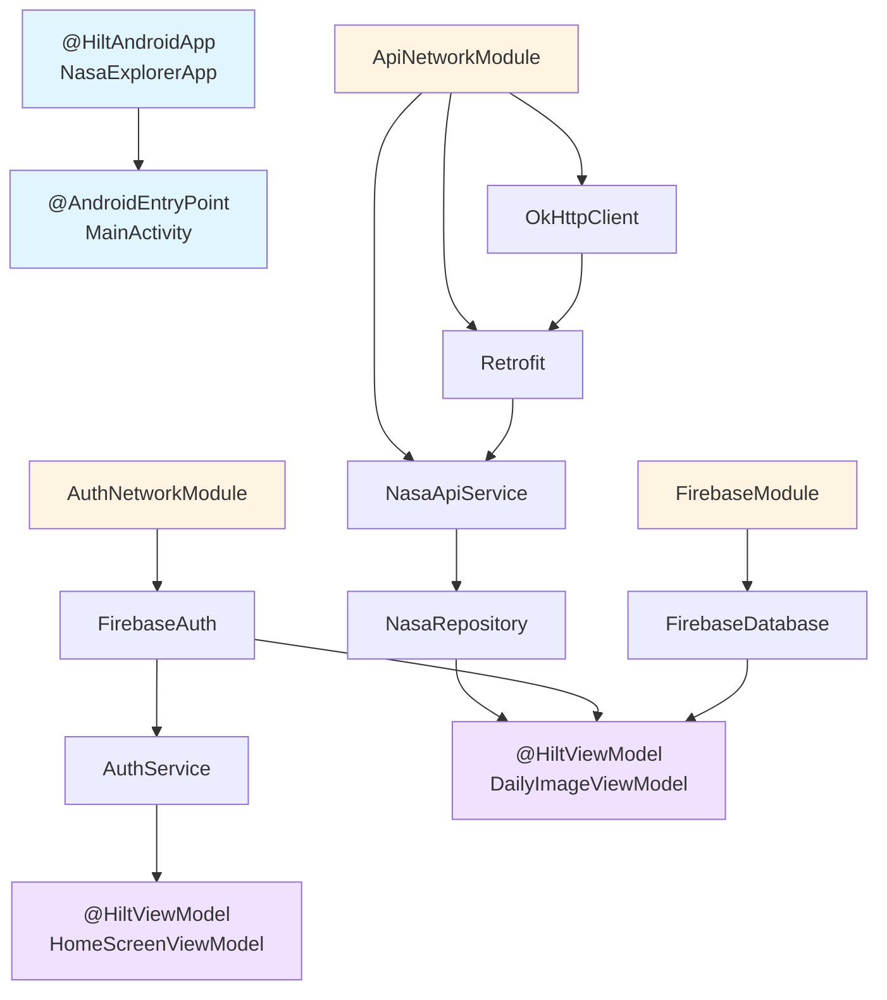

## Overview

NASA Explorer uses **Hilt**, a dependency injection library built on top of Dagger, to manage object creation and provide dependencies throughout the application. Hilt reduces boilerplate code and ensures proper scoping of dependencies.

## Why Dependency Injection?

Dependency injection provides several benefits:

<CardGroup cols={2}>
  <Card title="Loose Coupling" icon="link-slash">
    Components don't create their own dependencies, making them more flexible and reusable
  </Card>
  
  <Card title="Testability" icon="vial">
    Easy to swap implementations for testing by providing mock dependencies
  </Card>
  
  <Card title="Lifecycle Management" icon="recycle">
    Hilt manages object lifecycles, ensuring proper creation and cleanup
  </Card>
  
  <Card title="Code Reusability" icon="recycle">
    Singleton instances are shared across the app, reducing memory overhead
  </Card>
</CardGroup>

## Setting Up Hilt

### Application Setup

The application class must be annotated with `@HiltAndroidApp`:

```kotlin NasaExplorerApp.kt
package com.ccandeladev.nasaexplorer

import android.app.Application
import dagger.hilt.android.HiltAndroidApp

@HiltAndroidApp
class NasaExplorerApp: Application()
```

<Note>
  This annotation triggers Hilt's code generation including a base class for the application that serves as the application-level dependency container.
</Note>

### Activity Setup

Activities that use Hilt must be annotated with `@AndroidEntryPoint`:

```kotlin MainActivity.kt
@AndroidEntryPoint
class MainActivity : ComponentActivity() {
    override fun onCreate(savedInstanceState: Bundle?) {
        super.onCreate(savedInstanceState)
        setContent {
            NASAExplorerTheme {
                Surface(
                    modifier = Modifier.fillMaxSize(),
                    color = MaterialTheme.colorScheme.background
                ) {
                    val navController = rememberNavController()
                    NasaExplorerNav(navHostController = navController)
                }
            }
        }
    }
}
```

## Hilt Modules

Modules define how to provide dependencies. NASA Explorer has three main modules:

### 1. API Network Module

Provides networking dependencies for the NASA APOD API:

```kotlin data/di/ApiNetworkModule.kt
@Module
@InstallIn(SingletonComponent::class)
object ApiNetworkModule {

    private const val BASE_URL = "https://api.nasa.gov/"

    @Singleton
    @Provides
    fun provideNasaApiService(retrofit: Retrofit): NasaApiService {
        return retrofit.create(NasaApiService::class.java)
    }

    @Singleton
    @Provides
    fun provideRetrofit(okHttpClient: OkHttpClient): Retrofit {
        return Retrofit.Builder()
            .client(okHttpClient)
            .baseUrl(BASE_URL)
            .addConverterFactory(GsonConverterFactory.create())
            .build()
    }

    @Singleton
    @Provides
    fun provideHttpClient(): OkHttpClient {
        return OkHttpClient.Builder().build()
    }
}
```

<Steps>
  <Step title="@Module">
    Marks the object as a Hilt module that provides dependencies
  </Step>
  
  <Step title="@InstallIn(SingletonComponent::class)">
    Specifies that dependencies are available throughout the entire application lifecycle
  </Step>
  
  <Step title="@Singleton">
    Ensures only one instance is created and shared across the app
  </Step>
  
  <Step title="@Provides">
    Marks a method that provides a dependency
  </Step>
</Steps>

### 2. Firebase Module

Provides Firebase Database instance:

```kotlin data/di/FirebaseModule.kt
@Module
@InstallIn(SingletonComponent::class)
object FirebaseModule {

    @Provides
    @Singleton
    fun provideFirebaseDatabase(): FirebaseDatabase {
        return FirebaseDatabase.getInstance()
    }
}
```

### 3. Auth Network Module

Provides Firebase Authentication instance:

```kotlin data/auth/AuthNetworkModule.kt
@Module
@InstallIn(SingletonComponent::class)
object AuthNetworkModule {
    
    @Singleton
    @Provides
    fun provideFirebaseAuth() = FirebaseAuth.getInstance()
}
```

## Constructor Injection

### Repository Injection

The `NasaRepository` receives its dependencies through constructor injection:

```kotlin data/api/NasaRepository.kt
class NasaRepository @Inject constructor(
    private val nasaApiService: NasaApiService
) {
    companion object {
        private const val API_KEY = BuildConfig.NASA_API_KEY
    }

    suspend fun getImageOfTheDay(date: String? = null): NasaModel {
        val response = nasaApiService.getImageOfTheDay(
            apiKey = API_KEY, 
            date = date
        )
        return response.toNasaModel()
    }
    
    // ... other methods
}
```

<Note>
  The `@Inject` annotation tells Hilt to inject `NasaApiService` when creating the repository. Hilt automatically resolves the dependency from the `ApiNetworkModule`.
</Note>

### Service Injection

The `AuthService` receives Firebase Auth through constructor injection:

```kotlin data/auth/AuthService.kt
class AuthService @Inject constructor(
    private val firebaseAuth: FirebaseAuth
) {
    suspend fun login(email: String, password: String): FirebaseUser? {
        return firebaseAuth
            .signInWithEmailAndPassword(email, password)
            .await()
            .user
    }

    suspend fun register(email: String, password: String): FirebaseUser? {
        return suspendCancellableCoroutine { continuation ->
            firebaseAuth.createUserWithEmailAndPassword(email, password)
                .addOnSuccessListener { result ->
                    continuation.resume(result?.user)
                }
                .addOnFailureListener { exception ->
                    continuation.resumeWithException(exception)
                }
        }
    }

    fun userLogout() {
        firebaseAuth.signOut()
    }

    fun isUserLogged(): Boolean {
        return getCurrentUser() != null
    }

    private fun getCurrentUser() = firebaseAuth.currentUser
}
```

## ViewModel Injection

ViewModels use the `@HiltViewModel` annotation and receive dependencies through constructor injection:

```kotlin ui/homescreen/HomeScreenViewModel.kt
@HiltViewModel
class HomeScreenViewModel @Inject constructor(
    private val authService: AuthService
) : ViewModel() {

    fun logOut(){
        viewModelScope.launch(Dispatchers.IO){
            authService.userLogout()
        }
    }
}
```

A more complex example with multiple dependencies:

```kotlin ui/dailyimagescreen/DailyImageViewModel.kt
@HiltViewModel
class DailyImageViewModel @Inject constructor(
    private val nasaRepository: NasaRepository,
    private val firebaseAuth: FirebaseAuth,
    private val firebaseDatabase: FirebaseDatabase
) : ViewModel() {

    private val _dailyImage = MutableStateFlow<NasaModel?>(null)
    val dailyImage: StateFlow<NasaModel?> = _dailyImage

    private val _errorMessage = MutableStateFlow<String?>(null)
    val errorMessage: StateFlow<String?> = _errorMessage

    private val _isLoading = MutableStateFlow(false)
    val isLoading: StateFlow<Boolean> = _isLoading

    fun loadDailyImage(date: String? = null) {
        viewModelScope.launch {
            _isLoading.value = true
            try {
                val result = nasaRepository.getImageOfTheDay(date = date)
                _dailyImage.value = result
                _errorMessage.value = null
            } catch (e: Exception) {
                _errorMessage.value = "Sin conexión a internet..."
                _dailyImage.value = null
            } finally {
                _isLoading.value = false
            }
        }
    }
    
    // ... other methods
}
```

<Note>
  ViewModels are automatically injected into Composables using `hiltViewModel()`. Hilt handles ViewModel creation and ensures proper scoping to the navigation destination.
</Note>

## Dependency Graph

Here's how dependencies flow through the application:



## Scopes in Hilt

### Singleton Scope

Dependencies installed in `SingletonComponent` live for the entire application lifecycle:

```kotlin
@Module
@InstallIn(SingletonComponent::class)
object ApiNetworkModule {
    @Singleton
    @Provides
    fun provideRetrofit(okHttpClient: OkHttpClient): Retrofit {
        // Only one Retrofit instance throughout the app
        return Retrofit.Builder()
            .client(okHttpClient)
            .baseUrl(BASE_URL)
            .addConverterFactory(GsonConverterFactory.create())
            .build()
    }
}
```

### ViewModel Scope

ViewModels are scoped to the navigation destination and survive configuration changes:

```kotlin
@HiltViewModel
class HomeScreenViewModel @Inject constructor(
    private val authService: AuthService
) : ViewModel() {
    // ViewModel lives as long as the navigation destination
}
```

## Benefits of Hilt in NASA Explorer

<AccordionGroup>
  <Accordion title="Automatic Dependency Resolution">
    Hilt automatically resolves the entire dependency graph. For example, when creating `DailyImageViewModel`, Hilt knows it needs `NasaRepository`, which needs `NasaApiService`, which needs `Retrofit`, which needs `OkHttpClient` - all provided automatically.
  </Accordion>
  
  <Accordion title="No Manual Instantiation">
    No need to manually create objects. Hilt handles instantiation and passes dependencies through constructors.
  </Accordion>
  
  <Accordion title="Proper Lifecycle Management">
    Singleton components live for the app lifecycle, ViewModels are scoped to navigation destinations, ensuring proper cleanup.
  </Accordion>
  
  <Accordion title="Testing Support">
    Easy to replace production modules with test modules for unit and integration testing.
  </Accordion>
</AccordionGroup>

## Best Practices

### Use Constructor Injection

Prefer constructor injection over field injection:

```kotlin
// Good - Constructor injection
class NasaRepository @Inject constructor(
    private val nasaApiService: NasaApiService
)

// Avoid - Field injection
class NasaRepository {
    @Inject lateinit var nasaApiService: NasaApiService
}
```

### Keep Modules Focused

Each module should provide related dependencies:
- `ApiNetworkModule`: Network-related dependencies
- `FirebaseModule`: Firebase dependencies
- `AuthNetworkModule`: Authentication dependencies

### Use Singleton Appropriately

Only mark dependencies as `@Singleton` if they should be shared across the app:

```kotlin
@Singleton  // Good - Retrofit should be shared
@Provides
fun provideRetrofit(): Retrofit { ... }

// ViewModels should NOT be singleton
// They're scoped to navigation destinations
```

## Related Topics

<CardGroup cols={2}>
  <Card title="MVVM Pattern" icon="layer-group" href="/architecture/mvvm-pattern">
    See how dependency injection works with ViewModels
  </Card>
  
  <Card title="Architecture Overview" icon="sitemap" href="/architecture/overview">
    Understand how DI fits into the overall architecture
  </Card>
</CardGroup>