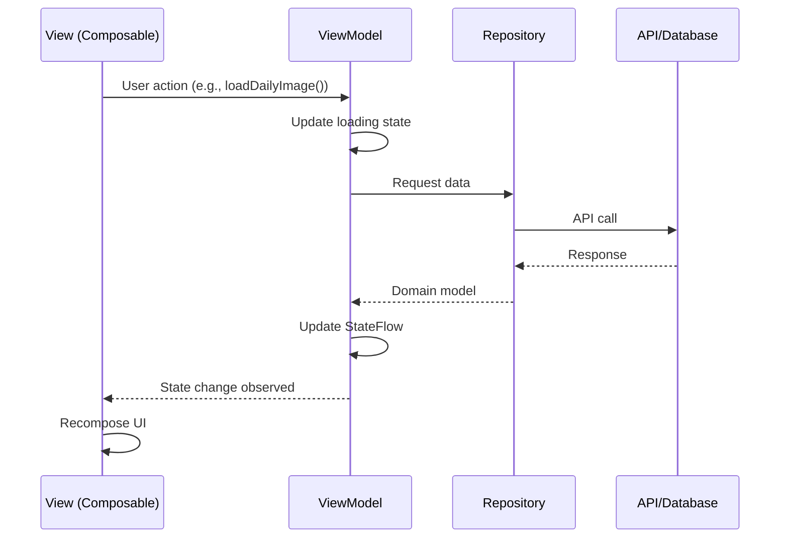

## Overview

NASA Explorer follows the **Model-View-ViewModel (MVVM)** architectural pattern, which provides clear separation between UI code and business logic. This pattern is the recommended approach for Android apps using Jetpack Compose.

## MVVM Components

<Steps>
  <Step title="Model">
    Represents the data and business logic. In NASA Explorer, models are defined in the `domain` package and represent the core business entities.
  </Step>
  
  <Step title="View">
    The UI layer built with Jetpack Compose. Views observe state from ViewModels and render the UI accordingly.
  </Step>
  
  <Step title="ViewModel">
    Acts as a bridge between the View and Model. Manages UI state, handles business logic, and survives configuration changes.
  </Step>
</Steps>

## The Model Layer

Models represent the core business entities and are independent of any framework:

```kotlin domain/NasaModel.kt
package com.ccandeladev.nasaexplorer.domain

// Modelo contiene solo los datos que se usaran en la UI
data class NasaModel(
    val title: String,
    val url: String,
    val date: String,
    val explanation: String,
)
```

<Note>
  The domain model is decoupled from the API response format. This separation allows the API to change without affecting the rest of the application.
</Note>

The repository layer transforms API responses into domain models:

```kotlin data/api/NasaRepository.kt
class NasaRepository @Inject constructor(
    private val nasaApiService: NasaApiService
) {
    companion object {
        private const val API_KEY = BuildConfig.NASA_API_KEY
    }

    // Obtener imagen del día
    suspend fun getImageOfTheDay(date: String? = null): NasaModel {
        val response = nasaApiService.getImageOfTheDay(
            apiKey = API_KEY, 
            date = date
        )
        return response.toNasaModel() // Convierte la respuesta a NasaModel
    }

    // Obtener imágenes en un rango de fechas
    suspend fun getImagesInRange(
        startDate: String, 
        endDate: String? = null
    ): List<NasaModel> {
        val response = nasaApiService.getImagesInRange(
            apiKey = API_KEY,
            startDate = startDate,
            endDate = endDate
        )
        return response.map { it.toNasaModel() }
    }

    // Obtener imágenes aleatorias
    suspend fun getRandomImages(count: Int): List<NasaModel> {
        val response = nasaApiService.getRandomImages(
            apiKey = API_KEY, 
            count = count
        )
        return response.map { it.toNasaModel() }
    }
}
```

## The ViewModel Layer

ViewModels manage UI state and business logic using Kotlin coroutines and StateFlow:

```kotlin ui/homescreen/HomeScreenViewModel.kt
@HiltViewModel
class HomeScreenViewModel @Inject constructor(
    private val authService: AuthService
) : ViewModel() {

    // Cerrar sesión (Hilo secundario)
    fun logOut(){
        viewModelScope.launch(Dispatchers.IO){
            authService.userLogout()
        }
    }
}
```

A more complex example with state management:

```kotlin ui/dailyimagescreen/DailyImageViewModel.kt
@HiltViewModel
class DailyImageViewModel @Inject constructor(
    private val nasaRepository: NasaRepository,
    private val firebaseAuth: FirebaseAuth,
    private val firebaseDatabase: FirebaseDatabase
) : ViewModel() {

    // Almacena la imagen diaria. Inicia en null
    private val _dailyImage = MutableStateFlow<NasaModel?>(null)
    val dailyImage: StateFlow<NasaModel?> = _dailyImage

    // Estado para manejar mensajes de error
    private val _errorMessage = MutableStateFlow<String?>(null)
    val errorMessage: StateFlow<String?> = _errorMessage

    // Controlar el estado de la carga de la imagen
    private val _isLoading = MutableStateFlow(false)
    val isLoading: StateFlow<Boolean> = _isLoading

    // Controlar el estado del icono de favoritos
    private val _isFavorite = MutableStateFlow<Boolean>(false)
    val isFavorite: StateFlow<Boolean> = _isFavorite

    /**
     * Cargar la imagen diaria
     * @param date opcion de cargar imagen en una fecha especificada
     */
    fun loadDailyImage(date: String? = null) {
        viewModelScope.launch {
            _isLoading.value = true
            try {
                val result = nasaRepository.getImageOfTheDay(date = date)
                _dailyImage.value = result
                _errorMessage.value = null
            } catch (e: Exception) {
                _errorMessage.value = "Sin conexión a internet..."
                _dailyImage.value = null
            } finally {
                _isLoading.value = false
            }
        }
    }

    /**
     * Guarda una imagen como favorita en Firebase
     */
    fun saveToFavorites(nasaModel: NasaModel) {
        val userId = firebaseAuth.currentUser?.uid
        if (userId != null) {
            viewModelScope.launch {
                try {
                    // Crear id en la BD
                    val favoriteRef = firebaseDatabase.reference
                        .child("favorites")
                        .child(userId)
                        .push()
                    
                    val favoriteImage = mapOf(
                        "id" to (favoriteRef.key ?: ""),
                        "title" to nasaModel.title,
                        "url" to nasaModel.url
                    )
                    
                    favoriteRef.setValue(favoriteImage).await()
                    _isFavorite.value = true
                } catch (e: Exception) {
                    _errorMessage.value = "Error al guardar favorito"
                }
            }
        }
    }
}
```

<Note>
  ViewModels expose **immutable** `StateFlow` properties to the UI while keeping **mutable** `MutableStateFlow` properties private. This prevents the UI from accidentally modifying state directly.
</Note>

## The View Layer

Views are built with Jetpack Compose and observe ViewModel state:

```kotlin ui/homescreen/HomeScreen.kt
@Composable
fun HomeScreen(
    homeScreenViewModel: HomeScreenViewModel = hiltViewModel(),
    onNavigateToLogin: () -> Unit
) {
    val navController = rememberNavController()

    // Botón "atrás" -> solo vuelve al home
    BackHandler {
        navController.popBackStack(Routes.Home, inclusive = false)
    }

    Scaffold(
        topBar = {
            HomeTopBar(
                navController = navController,
                homeScreenViewModel = homeScreenViewModel,
                onNavigateToLogin = onNavigateToLogin
            )
        },
        bottomBar = {
            HomeBottomBar(navController = navController)
        }
    ) { paddingValues ->
        // NavHost para gestionar navegacion interna
        NavHost(
            navController = navController,
            startDestination = Routes.Home,
            modifier = Modifier
                .fillMaxSize()
                .padding(paddingValues)
        ) {
            composable<Routes.Home> { HomeScreenContent() }
            composable<Routes.DailyImage> { DailyImageScreen() }
            composable<Routes.RandomImage> { RandomImageScreen() }
            composable<Routes.RangeImages> { RangeImagesScreen() }
            composable<Routes.FavoriteImages> { FavoritesScreen() }
        }
    }
}
```

## ViewModel Injection

ViewModels are automatically injected using Hilt's `hiltViewModel()` function:

```kotlin
@Composable
fun HomeScreen(
    homeScreenViewModel: HomeScreenViewModel = hiltViewModel(),
    onNavigateToLogin: () -> Unit
) {
    // ViewModel is automatically created and injected
    // All dependencies are resolved by Hilt
}
```

<Note>
  The `@HiltViewModel` annotation tells Hilt to generate the necessary code for ViewModel injection. Dependencies are provided through constructor injection.
</Note>

## State Management Best Practices

### Use StateFlow for Observable State

```kotlin
private val _isLoading = MutableStateFlow(false)
val isLoading: StateFlow<Boolean> = _isLoading
```

### Handle Loading States

```kotlin
fun loadData() {
    viewModelScope.launch {
        _isLoading.value = true
        try {
            // Load data
        } catch (e: Exception) {
            _errorMessage.value = e.message
        } finally {
            _isLoading.value = false
        }
    }
}
```

### Use viewModelScope for Coroutines

```kotlin
fun logOut(){
    viewModelScope.launch(Dispatchers.IO){
        authService.userLogout()
    }
}
```

<Note>
  `viewModelScope` automatically cancels coroutines when the ViewModel is cleared, preventing memory leaks.
</Note>

## MVVM Data Flow



## Benefits of MVVM

<AccordionGroup>
  <Accordion title="Separation of Concerns">
    UI logic is separated from business logic, making code more maintainable and testable.
  </Accordion>
  
  <Accordion title="Survives Configuration Changes">
    ViewModels survive configuration changes like screen rotations, preserving state without additional code.
  </Accordion>
  
  <Accordion title="Testability">
    ViewModels can be unit tested without requiring Android framework dependencies.
  </Accordion>
  
  <Accordion title="Reactive UI">
    StateFlow provides reactive programming patterns, automatically updating UI when state changes.
  </Accordion>
</AccordionGroup>

## Related Topics

<CardGroup cols={2}>
  <Card title="Dependency Injection" icon="plug" href="/architecture/dependency-injection">
    Learn how ViewModels get their dependencies
  </Card>
  
  <Card title="Navigation" icon="route" href="/architecture/navigation">
    Understand how ViewModels work with navigation
  </Card>
</CardGroup>