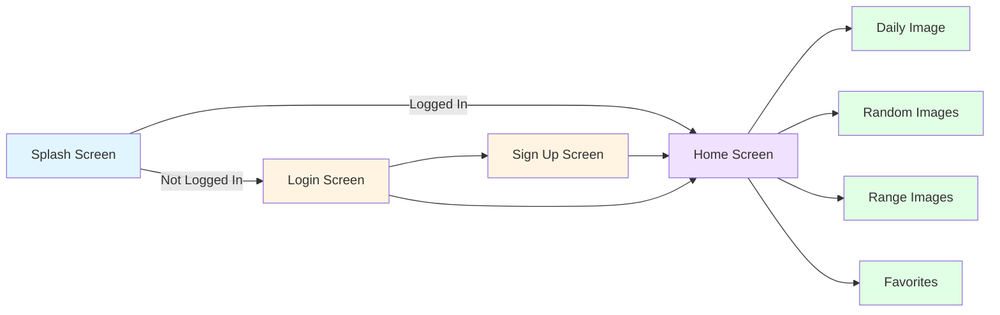
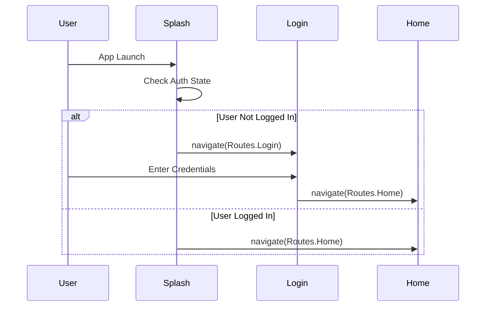
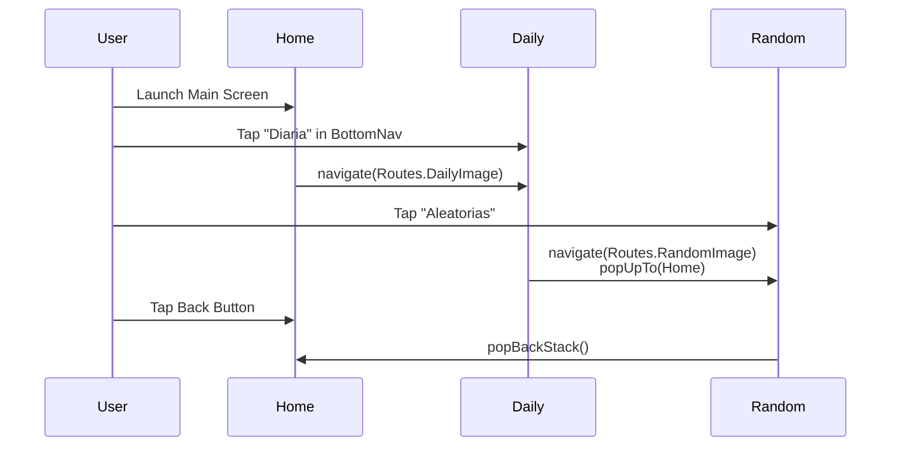

## Overview

NASA Explorer uses **Jetpack Compose Navigation** with Kotlin serialization for type-safe navigation between screens. The app has two navigation levels: authentication flow and main app flow.

## Navigation Structure



## Type-Safe Routes

Routes are defined as a sealed class with serializable objects:

```kotlin ui/core/Routes.kt
package com.ccandeladev.nasaexplorer.ui.core

import kotlinx.serialization.Serializable

sealed class Routes {

    @Serializable
    data object Splash : Routes()

    @Serializable
    data object Login : Routes()

    @Serializable
    data object SignUp : Routes()

    @Serializable
    data object Home : Routes()

    @Serializable
    data object DailyImage : Routes()

    @Serializable
    data object RangeImages : Routes()

    @Serializable
    data object RandomImage : Routes()

    @Serializable
    data object FavoriteImages: Routes()
}
```

<Note>
  Using sealed classes with `@Serializable` provides compile-time safety. The compiler ensures you can't navigate to a route that doesn't exist, and navigation arguments are type-checked.
</Note>

## Top-Level Navigation

The main navigation graph handles authentication flow:

```kotlin ui/core/NasaExplorerNav.kt
@Composable
fun NasaExplorerNav(navHostController: NavHostController) {
    // Configurar navHost con controlador y ruta de inicio
    NavHost(
        navController = navHostController, 
        startDestination = Routes.Splash
    ) {

        // SplashScreen - decides authentication state
        composable<Routes.Splash> {
            SplashScreen(
                onNavigateToLogin = {
                    navHostController.navigate(Routes.Login)
                }, 
                onNavigateToHome = {
                    navHostController.navigate(Routes.Home)
                }
            )
        }

        // LoginScreen
        composable<Routes.Login> {
            LoginScreen(
                onNavigationToHome = {
                    navHostController.navigate(Routes.Home)
                }, 
                onNavigationToSignUp = {
                    navHostController.navigate(Routes.SignUp)
                }
            )
        }

        // SignUpScreen
        composable<Routes.SignUp> {
            SignUpScreen(
                onNavigateToHome = {
                    navHostController.navigate(Routes.Home)
                }
            )
        }

        // HomeScreen - main app entry point
        composable<Routes.Home> {
            HomeScreen(
                onNavigateToLogin = {
                    navHostController.navigate(Routes.Login)
                }
            )
        }
    }
}
```

<Steps>
  <Step title="NavHost Setup">
    Create a `NavHost` with a `NavController` and starting destination
  </Step>
  
  <Step title="Composable Destinations">
    Define each screen as a `composable` with type-safe route
  </Step>
  
  <Step title="Navigation Callbacks">
    Pass lambda callbacks to child composables for navigation actions
  </Step>
</Steps>

## Nested Navigation

The `HomeScreen` contains its own nested navigation graph for the main app features:

```kotlin ui/homescreen/HomeScreen.kt
@Composable
fun HomeScreen(
    homeScreenViewModel: HomeScreenViewModel = hiltViewModel(),
    onNavigateToLogin: () -> Unit
) {
    // NavController para gestionar navegación interna
    val navController = rememberNavController()

    // Botón "atrás" -> solo vuelve al home
    BackHandler {
        navController.popBackStack(Routes.Home, inclusive = false)
    }

    Scaffold(
        topBar = {
            HomeTopBar(
                navController = navController,
                homeScreenViewModel = homeScreenViewModel,
                onNavigateToLogin = onNavigateToLogin
            )
        },
        bottomBar = {
            HomeBottomBar(navController = navController)
        }
    ) { paddingValues ->

        // Nested NavHost for main features
        NavHost(
            navController = navController,
            startDestination = Routes.Home,
            enterTransition = { fadeIn(animationSpec = tween(1500)) },
            exitTransition = { fadeOut(animationSpec = tween(1500)) },
            modifier = Modifier
                .fillMaxSize()
                .background(Color.Black)
                .padding(paddingValues)
        ) {
            composable<Routes.Home> { HomeScreenContent() }
            composable<Routes.DailyImage> { DailyImageScreen() }
            composable<Routes.RandomImage> { RandomImageScreen() }
            composable<Routes.RangeImages> { RangeImagesScreen() }
            composable<Routes.FavoriteImages> { FavoritesScreen() }
        }
    }
}
```

<Note>
  The nested navigation uses a separate `NavController` and has custom transition animations (fade in/out with 1500ms duration).
</Note>

## Bottom Navigation Bar

The bottom navigation bar handles navigation between main features:

```kotlin ui/homescreen/HomeScreen.kt
@Composable
fun HomeBottomBar(navController: NavController) {
    // Estado para el item seleccionado
    var selectedItem by remember { mutableIntStateOf(-1) }

    NavigationBar(
        containerColor = MaterialTheme.colorScheme.primary.copy(alpha = 0.8f)
    ) {
        // Home item
        NavigationBarItem(
            selected = selectedItem == 0,
            onClick = {
                if (selectedItem != 0) {
                    selectedItem = 0
                    navController.navigate(Routes.Home) {
                        popUpTo<Routes.Home> { inclusive = false }
                    }
                }
            },
            icon = {
                Icon(
                    imageVector = Icons.Default.Home,
                    contentDescription = "Home",
                    tint = MaterialTheme.colorScheme.onPrimary
                )
            },
            label = { Text(text = "Inicio") }
        )
        
        // Daily Image item
        NavigationBarItem(
            selected = selectedItem == 1,
            onClick = {
                if (selectedItem != 1) {
                    selectedItem = 1
                    navController.navigate(Routes.DailyImage) {
                        popUpTo<Routes.Home> { inclusive = false }
                    }
                }
            },
            icon = {
                Icon(
                    imageVector = Icons.Filled.Today,
                    contentDescription = "Daily Image"
                )
            },
            label = { Text(text = "Diaria") }
        )
        
        // Random Images item
        NavigationBarItem(
            selected = selectedItem == 2,
            onClick = {
                selectedItem = 2
                navController.navigate(Routes.RandomImage) {
                    popUpTo<Routes.Home> { inclusive = false }
                }
            },
            icon = {
                Icon(
                    imageVector = Icons.Filled.Shuffle,
                    contentDescription = "Random images"
                )
            },
            label = { Text(text = "Aleatorias") }
        )
        
        // Range Images item
        NavigationBarItem(
            selected = selectedItem == 3,
            onClick = {
                selectedItem = 3
                navController.navigate(Routes.RangeImages) {
                    popUpTo<Routes.Home> { inclusive = false }
                }
            },
            icon = {
                Icon(
                    imageVector = Icons.Default.DateRange,
                    contentDescription = "Period images"
                )
            },
            label = { Text(text = "Rango") }
        )
        
        // Favorites item
        NavigationBarItem(
            selected = selectedItem == 4,
            onClick = {
                selectedItem = 4
                navController.navigate(Routes.FavoriteImages) {
                    popUpTo<Routes.Home> { inclusive = false }
                }
            },
            icon = {
                Icon(
                    imageVector = Icons.Default.Favorite,
                    contentDescription = "Favorites"
                )
            },
            label = { Text(text = "Favoritos") }
        )
    }
}
```

## Navigation Patterns

### Simple Navigation

Navigate to a new screen:

```kotlin
navController.navigate(Routes.DailyImage)
```

### Navigation with Back Stack Management

Navigate and clear back stack:

```kotlin
navController.navigate(Routes.Home) {
    popUpTo<Routes.Home> { inclusive = false }
}
```

<Note>
  This pattern prevents building up a large back stack when navigating between bottom navigation items. It clears everything up to (but not including) the Home route.
</Note>

### Navigation with Callbacks

Pass navigation actions as callbacks to child composables:

```kotlin
SplashScreen(
    onNavigateToLogin = {
        navHostController.navigate(Routes.Login)
    },
    onNavigateToHome = {
        navHostController.navigate(Routes.Home)
    }
)
```

### Back Navigation Handling

Custom back button behavior:

```kotlin
BackHandler {
    navController.popBackStack(Routes.Home, inclusive = false)
}
```

## Navigation with Transitions

Add custom animations to navigation:

```kotlin
NavHost(
    navController = navController,
    startDestination = Routes.Home,
    enterTransition = { 
        fadeIn(animationSpec = tween(1500)) 
    },
    exitTransition = { 
        fadeOut(animationSpec = tween(1500)) 
    }
) {
    // ... composables
}
```

<CardGroup cols={2}>
  <Card title="Fade In" icon="arrow-right">
    Screens fade in over 1500ms when entering
  </Card>
  
  <Card title="Fade Out" icon="arrow-left">
    Screens fade out over 1500ms when exiting
  </Card>
</CardGroup>

## Navigation Best Practices

### 1. Type-Safe Routes

Always use sealed classes with `@Serializable` for compile-time safety:

```kotlin
// Good - Type-safe
sealed class Routes {
    @Serializable
    data object Home : Routes()
}

// Avoid - String-based routes
const val HOME_ROUTE = "home"
```

### 2. Single NavController per Level

Use separate `NavController` instances for different navigation levels:

- **Top-level**: Authentication flow (Splash, Login, SignUp, Home)
- **Nested level**: Main features (DailyImage, RandomImage, etc.)

### 3. Callback-Based Navigation

Pass navigation actions as callbacks rather than passing the `NavController`:

```kotlin
// Good - Callbacks
@Composable
fun LoginScreen(
    onNavigateToHome: () -> Unit,
    onNavigateToSignUp: () -> Unit
)

// Avoid - Passing NavController
@Composable
fun LoginScreen(navController: NavController)
```

### 4. Manage Back Stack

Use `popUpTo` to prevent back stack buildup:

```kotlin
navController.navigate(Routes.Home) {
    popUpTo<Routes.Home> { inclusive = false }
}
```

## Navigation Flow Examples

### Authentication Flow



### Main App Flow



## Related Topics

<CardGroup cols={2}>
  <Card title="Architecture Overview" icon="sitemap" href="/architecture/overview">
    See how navigation fits into the overall architecture
  </Card>
  
  <Card title="MVVM Pattern" icon="layer-group" href="/architecture/mvvm-pattern">
    Learn how ViewModels work with navigation
  </Card>
</CardGroup>