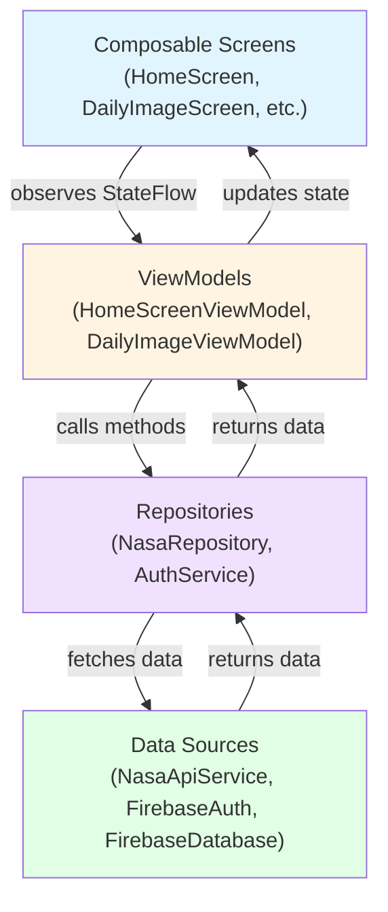

## Introduction

NASA Explorer is built using modern Android development best practices, following a clean architecture approach that separates concerns across multiple layers. The app leverages **Jetpack Compose** for UI, **Hilt** for dependency injection, and **Firebase** for authentication and data persistence.

## Architecture Layers

The application is structured in three main layers:

<Steps>
  <Step title="Presentation Layer (UI)">
    Contains Jetpack Compose screens and ViewModels that handle UI logic and state management. Each screen has a corresponding ViewModel that manages business logic and state.
  </Step>
  
  <Step title="Domain Layer">
    Defines the core business models used throughout the application. This layer is independent of frameworks and represents the business entities.
  </Step>
  
  <Step title="Data Layer">
    Manages data operations including API calls, authentication, and Firebase database interactions. Contains repositories, API services, and dependency injection modules.
  </Step>
</Steps>

## Project Structure

```kotlin
com.ccandeladev.nasaexplorer/
├── MainActivity.kt              # Entry point
├── NasaExplorerApp.kt          # Application class with Hilt
├── data/
│   ├── api/
│   │   ├── NasaApiService.kt   # Retrofit API interface
│   │   ├── NasaRepository.kt   # Data repository
│   │   └── NasaResponse.kt     # API response models
│   ├── auth/
│   │   ├── AuthService.kt      # Firebase auth operations
│   │   └── AuthNetworkModule.kt # Auth DI module
│   └── di/
│       ├── ApiNetworkModule.kt  # Network DI module
│       └── FirebaseModule.kt    # Firebase DI module
├── domain/
│   ├── NasaModel.kt            # Core domain model
│   └── FavoriteNasaModel.kt    # Favorites model
└── ui/
    ├── core/
    │   ├── Routes.kt           # Navigation routes
    │   └── NasaExplorerNav.kt  # Navigation graph
    ├── homescreen/
    │   ├── HomeScreen.kt       # Home UI
    │   └── HomeScreenViewModel.kt # Home logic
    ├── dailyimagescreen/       # Daily image feature
    ├── randomimagescreen/      # Random images feature
    ├── rangeimagesscreen/      # Date range feature
    └── favoritesscreen/        # Favorites feature
```

## Application Entry Point

The app initialization begins with the `NasaExplorerApp` class, which enables Hilt dependency injection:

```kotlin NasaExplorerApp.kt
package com.ccandeladev.nasaexplorer

import android.app.Application
import dagger.hilt.android.HiltAndroidApp

@HiltAndroidApp
class NasaExplorerApp: Application()
```

<Note>
  The `@HiltAndroidApp` annotation triggers Hilt's code generation and enables dependency injection throughout the entire application lifecycle.
</Note>

The `MainActivity` sets up the Compose UI and navigation:

```kotlin MainActivity.kt
@AndroidEntryPoint
class MainActivity : ComponentActivity() {
    override fun onCreate(savedInstanceState: Bundle?) {
        super.onCreate(savedInstanceState)
        setContent {
            NASAExplorerTheme {
                Surface(
                    modifier = Modifier.fillMaxSize(),
                    color = MaterialTheme.colorScheme.background
                ) {
                    val navController = rememberNavController()
                    NasaExplorerNav(navHostController = navController)
                }
            }
        }
    }
}
```

## Key Technologies

<CardGroup cols={2}>
  <Card title="Jetpack Compose" icon="mobile">
    Modern declarative UI framework for building native Android interfaces
  </Card>
  
  <Card title="Hilt / Dagger" icon="plug">
    Dependency injection framework for managing object creation and lifecycle
  </Card>
  
  <Card title="Kotlin Coroutines" icon="rotate">
    Asynchronous programming for network calls and database operations
  </Card>
  
  <Card title="Firebase" icon="fire">
    Authentication and Realtime Database for user management and favorites
  </Card>
  
  <Card title="Retrofit" icon="network-wired">
    Type-safe HTTP client for NASA APOD API integration
  </Card>
  
  <Card title="Navigation Compose" icon="route">
    Type-safe navigation between composable screens
  </Card>
</CardGroup>

## Design Principles

### Separation of Concerns
Each layer has a clear responsibility. UI components don't directly access the network, and business logic is isolated in ViewModels.

### Unidirectional Data Flow
Data flows from the data layer through ViewModels to the UI. User actions flow back down through callbacks.

### Single Source of Truth
ViewModels hold the single source of truth for UI state using `StateFlow`, ensuring consistent UI updates.

### Testability
Dependency injection and layer separation enable easy unit testing of individual components.

## Architecture Diagram



## Next Steps

<CardGroup cols={2}>
  <Card title="MVVM Pattern" icon="layer-group" href="/architecture/mvvm-pattern">
    Learn how the MVVM pattern is implemented in NASA Explorer
  </Card>
  
  <Card title="Dependency Injection" icon="plug" href="/architecture/dependency-injection">
    Explore how Hilt manages dependencies across the app
  </Card>
  
  <Card title="Navigation" icon="route" href="/architecture/navigation">
    Understand the type-safe navigation system
  </Card>
</CardGroup>