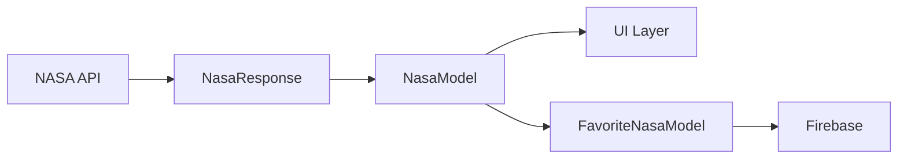

## Overview

The NASA Explorer app uses multiple model classes to represent data across different layers of the architecture. This page documents the response models, domain models, and favorite models.

## Architecture Layers

<CardGroup cols={2}>
  <Card title="Data Layer" icon="database">
    `NasaResponse` - Raw API response mapping
  </Card>
  <Card title="Domain Layer" icon="cube">
    `NasaModel` - Business logic model
  </Card>
  <Card title="Persistence Layer" icon="bookmark">
    `FavoriteNasaModel` - Firebase storage model
  </Card>
</CardGroup>

## NasaResponse (Data Layer)

Maps the complete structure of NASA's APOD API response using Gson serialization.

```kotlin
package com.ccandeladev.nasaexplorer.data.api

import com.ccandeladev.nasaexplorer.domain.NasaModel
import com.google.gson.annotations.SerializedName

data class NasaResponse(
    @SerializedName("title") val title: String,
    @SerializedName("url") val url: String,
    @SerializedName("date") val date: String,
    @SerializedName("explanation") val explanation: String,
    @SerializedName("media_type") val mediaType: String?,
    @SerializedName("hdurl") val hdUrl: String?,
    @SerializedName("service_version") val serviceVersion: String?,
    @SerializedName("copyright") val copyright: String?
)
```

### Fields

<ParamField path="title" type="String" required>
  Title of the astronomy picture or video
</ParamField>

<ParamField path="url" type="String" required>
  URL of the standard resolution media
</ParamField>

<ParamField path="date" type="String" required>
  Date of the APOD in YYYY-MM-DD format
</ParamField>

<ParamField path="explanation" type="String" required>
  Detailed explanation of the astronomical content
</ParamField>

<ParamField path="mediaType" type="String" optional>
  Type of media: "image" or "video"
</ParamField>

<ParamField path="hdUrl" type="String" optional>
  URL of the high-definition version (if available)
</ParamField>

<ParamField path="serviceVersion" type="String" optional>
  Version of the APOD API service
</ParamField>

<ParamField path="copyright" type="String" optional>
  Copyright information for the media
</ParamField>

### Extension Function

Converts API response to domain model:

```kotlin
fun NasaResponse.toNasaModel(): NasaModel {
    return NasaModel(
        title = this.title,
        url = this.url,
        date = this.date,
        explanation = this.explanation
    )
}
```

<Info>
  The extension function filters out optional fields, keeping only essential data for the UI layer.
</Info>

## NasaModel (Domain Layer)

Simplified model containing only the data needed for business logic and UI rendering.

```kotlin
package com.ccandeladev.nasaexplorer.domain

data class NasaModel(
    val title: String,
    val url: String,
    val date: String,
    val explanation: String,
)
```

### Purpose

<Check>
  **Decouples** data layer from business logic and UI
</Check>

<Check>
  **Simplifies** UI components by providing only necessary fields
</Check>

<Check>
  **Protects** against API changes affecting the entire application
</Check>

### Fields

<ResponseField name="title" type="String">
  Display title for the astronomy image
</ResponseField>

<ResponseField name="url" type="String">
  Image or video URL for display
</ResponseField>

<ResponseField name="date" type="String">
  Date in YYYY-MM-DD format for sorting and display
</ResponseField>

<ResponseField name="explanation" type="String">
  Full explanation text for detail screens
</ResponseField>

### Usage Example

```kotlin
// In ViewModel
val nasaImage = NasaModel(
    title = "The Horsehead Nebula",
    url = "https://apod.nasa.gov/apod/image/2401/horsehead.jpg",
    date = "2024-01-15",
    explanation = "One of the most identifiable nebulae in the sky..."
)

// In Composable
@Composable
fun ImageCard(nasaModel: NasaModel) {
    Column {
        Text(text = nasaModel.title, style = MaterialTheme.typography.h6)
        AsyncImage(model = nasaModel.url, contentDescription = nasaModel.title)
        Text(text = nasaModel.date, style = MaterialTheme.typography.caption)
        Text(text = nasaModel.explanation)
    }
}
```

## FavoriteNasaModel (Persistence Layer)

Model for storing favorite images in Firebase with unique identifiers.

```kotlin
package com.ccandeladev.nasaexplorer.domain

data class FavoriteNasaModel(
    val firebaseImageId: String,
    val title: String,
    val url: String
)
```

### Fields

<ParamField path="firebaseImageId" type="String" required>
  Unique ID generated by Firebase for each saved image
</ParamField>

<ParamField path="title" type="String" required>
  Title of the favorited astronomy image
</ParamField>

<ParamField path="url" type="String" required>
  Image URL for display in favorites list
</ParamField>

### Purpose

<Info>
  The `firebaseImageId` is essential for:
  - Uniquely identifying favorites in Firebase
  - Enabling delete operations
  - Linking images to user comments
</Info>

### Usage Example

```kotlin
// Saving a favorite
fun saveFavorite(nasaModel: NasaModel) {
    val favoriteRef = firestore.collection("favorites").document()
    val favorite = FavoriteNasaModel(
        firebaseImageId = favoriteRef.id,
        title = nasaModel.title,
        url = nasaModel.url
    )
    favoriteRef.set(favorite)
}

// Deleting a favorite
fun deleteFavorite(favoriteNasaModel: FavoriteNasaModel) {
    firestore.collection("favorites")
        .document(favoriteNasaModel.firebaseImageId)
        .delete()
}
```

## Model Transformation Flow



<Steps>
  <Step title="API Response">
    NASA API returns JSON, deserialized to `NasaResponse`
  </Step>
  <Step title="Domain Conversion">
    Repository converts `NasaResponse` to `NasaModel` using `toNasaModel()`
  </Step>
  <Step title="UI Display">
    ViewModel exposes `NasaModel` to Composables
  </Step>
  <Step title="Persistence">
    User favorites are saved as `FavoriteNasaModel` in Firebase
  </Step>
</Steps>

## Best Practices

<Warning>
  Always use domain models (`NasaModel`) in your UI layer, never expose raw API responses.
</Warning>

<Tip>
  Keep domain models immutable using `val` properties for thread safety.
</Tip>

<Check>
  Use data classes for automatic `equals()`, `hashCode()`, and `copy()` implementations.
</Check>

## Related Components

- [NASA API Service](/components/api-service) - Network calls returning `NasaResponse`
- [NASA Repository](/components/repository) - Transforms responses to domain models
