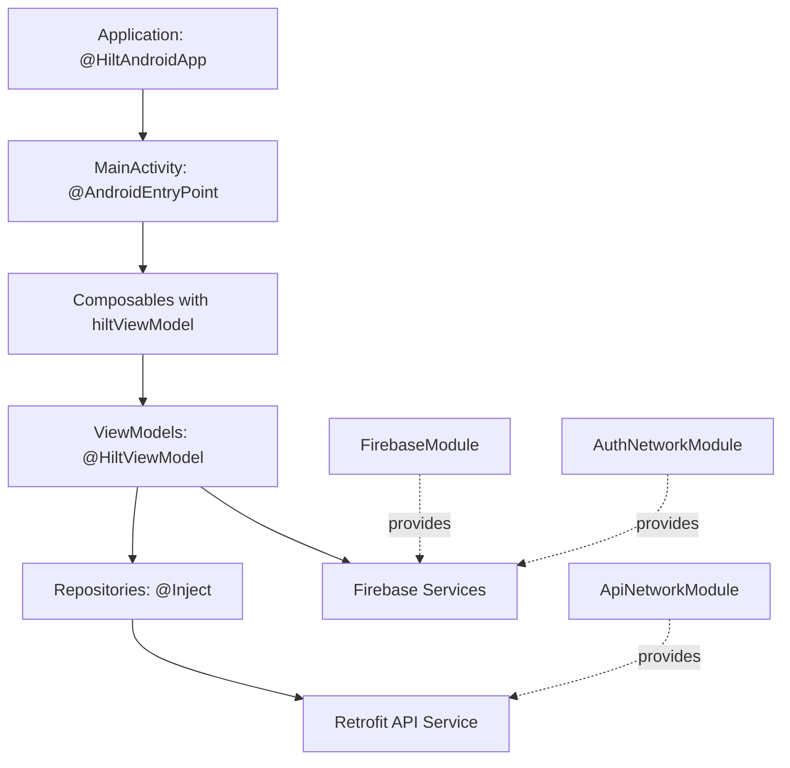

## Overview

NASA Explorer uses **Hilt** for dependency injection, providing a standardized way to manage dependencies across the application. Hilt is built on top of Dagger and provides compile-time correctness, runtime performance, and Android framework integration.

<Info>
Hilt is Google's recommended dependency injection solution for Android. It reduces boilerplate code and provides a consistent way to inject dependencies into Android components.
</Info>

## Why Dependency Injection?

<CardGroup cols={2}>
  <Card title="Testability" icon="flask">
    Easy to swap implementations for testing with mocks
  </Card>
  <Card title="Reusability" icon="recycle">
    Share single instances across the entire app
  </Card>
  <Card title="Maintainability" icon="wrench">
    Centralize dependency creation and configuration
  </Card>
  <Card title="Loose Coupling" icon="link-slash">
    Components don't need to know how to create their dependencies
  </Card>
</CardGroup>

## Project Setup

Hilt is configured in the app's build configuration:

```kotlin build.gradle.kts
plugins {
    alias(libs.plugins.android.application)
    alias(libs.plugins.jetbrains.kotlin.android)
    kotlin("kapt")  // Required for Hilt annotation processing
    alias(libs.plugins.hilt)
}

dependencies {
    // Hilt dependencies
    implementation(libs.dagger.hilt)
    implementation(libs.dagger.hilt.navigation)  // Hilt integration with Compose Navigation
    kapt(libs.dagger.hilt.compiler)
}
```

```kotlin build.gradle.kts (root)
plugins {
    alias(libs.plugins.android.application) apply false
    alias(libs.plugins.jetbrains.kotlin.android) apply false
    alias(libs.plugins.hilt) apply false
}
```

## Application Class

The entry point for Hilt is the application class annotated with `@HiltAndroidApp`:

```kotlin NasaExplorerApp.kt
package com.ccandeladev.nasaexplorer

import android.app.Application
import dagger.hilt.android.HiltAndroidApp

@HiltAndroidApp
class NasaExplorerApp: Application()
```

<Note>
The application class must be registered in `AndroidManifest.xml` with `android:name=".NasaExplorerApp"`
</Note>

## Activity Integration

Activities that use Hilt must be annotated with `@AndroidEntryPoint`:

```kotlin MainActivity.kt
package com.ccandeladev.nasaexplorer

import android.os.Bundle
import androidx.activity.ComponentActivity
import androidx.activity.compose.setContent
import dagger.hilt.android.AndroidEntryPoint

@AndroidEntryPoint
class MainActivity : ComponentActivity() {
    override fun onCreate(savedInstanceState: Bundle?) {
        super.onCreate(savedInstanceState)
        setContent {
            NASAExplorerTheme {
                // UI content
            }
        }
    }
}
```

## Hilt Modules

Modules define how to provide dependencies. NASA Explorer has several modules:

### API Network Module

Provides Retrofit and HTTP client instances:

```kotlin ApiNetworkModule.kt
package com.ccandeladev.nasaexplorer.data.di

import com.ccandeladev.nasaexplorer.data.api.NasaApiService
import dagger.Module
import dagger.Provides
import dagger.hilt.InstallIn
import dagger.hilt.components.SingletonComponent
import okhttp3.OkHttpClient
import retrofit2.Retrofit
import retrofit2.converter.gson.GsonConverterFactory
import javax.inject.Singleton

@Module
@InstallIn(SingletonComponent::class)
object ApiNetworkModule {

    private const val BASE_URL = "https://api.nasa.gov/"

    @Singleton
    @Provides
    fun provideNasaApiService(retrofit: Retrofit): NasaApiService {
        return retrofit.create(NasaApiService::class.java)
    }

    @Singleton
    @Provides
    fun provideRetrofit(okHttpClient: OkHttpClient): Retrofit {
        return Retrofit.Builder()
            .client(okHttpClient)
            .baseUrl(BASE_URL)
            .addConverterFactory(GsonConverterFactory.create())
            .build()
    }

    @Singleton
    @Provides
    fun provideHttpClient(): OkHttpClient {
        return OkHttpClient.Builder().build()
    }
}
```

<Tip>
`@InstallIn(SingletonComponent::class)` means these dependencies live as long as the application and are shared across all components.
</Tip>

### Firebase Module

Provides Firebase instances:

```kotlin FirebaseModule.kt
package com.ccandeladev.nasaexplorer.data.di

import com.google.firebase.database.FirebaseDatabase
import dagger.Module
import dagger.Provides
import dagger.hilt.InstallIn
import dagger.hilt.components.SingletonComponent
import javax.inject.Singleton

@Module
@InstallIn(SingletonComponent::class)
object FirebaseModule {

    @Provides
    @Singleton
    fun provideFirebaseDatabase(): FirebaseDatabase {
        return FirebaseDatabase.getInstance()
    }
}
```

### Auth Network Module

Provides Firebase Authentication:

```kotlin AuthNetworkModule.kt
package com.ccandeladev.nasaexplorer.data.auth

import com.google.firebase.auth.FirebaseAuth
import dagger.Module
import dagger.Provides
import dagger.hilt.InstallIn
import dagger.hilt.components.SingletonComponent
import javax.inject.Singleton

@Module
@InstallIn(SingletonComponent::class)
object AuthNetworkModule {
    @Singleton
    @Provides
    fun provideFirebaseAuth() = FirebaseAuth.getInstance()
}
```

## Constructor Injection

Classes can use `@Inject` constructor annotation to receive dependencies:

### Repository Example

```kotlin NasaRepository.kt
package com.ccandeladev.nasaexplorer.data.api

import com.ccandeladev.nasaexplorer.BuildConfig
import com.ccandeladev.nasaexplorer.domain.NasaModel
import javax.inject.Inject

class NasaRepository @Inject constructor(
    private val nasaApiService: NasaApiService
) {
    companion object {
        private const val API_KEY = BuildConfig.NASA_API_KEY
    }

    suspend fun getImageOfTheDay(date: String? = null): NasaModel {
        val response = nasaApiService.getImageOfTheDay(apiKey = API_KEY, date = date)
        return response.toNasaModel()
    }

    suspend fun getImagesInRange(startDate: String, endDate: String? = null): List<NasaModel> {
        val response = nasaApiService.getImagesInRange(
            apiKey = API_KEY,
            startDate = startDate,
            endDate = endDate
        )
        return response.map { it.toNasaModel() }
    }
}
```

### Auth Service Example

```kotlin AuthService.kt
package com.ccandeladev.nasaexplorer.data.auth

import com.google.firebase.auth.FirebaseAuth
import com.google.firebase.auth.FirebaseUser
import kotlinx.coroutines.tasks.await
import javax.inject.Inject

class AuthService @Inject constructor(
    private val firebaseAuth: FirebaseAuth
) {
    suspend fun login(email: String, password: String): FirebaseUser? {
        return firebaseAuth.signInWithEmailAndPassword(email, password).await().user
    }

    suspend fun register(email: String, password: String): FirebaseUser? {
        return firebaseAuth.createUserWithEmailAndPassword(email, password).await().user
    }

    fun userLogout() {
        firebaseAuth.signOut()
    }

    fun isUserLogged(): Boolean {
        return firebaseAuth.currentUser != null
    }
}
```

## ViewModel Injection

ViewModels use `@HiltViewModel` annotation and constructor injection:

```kotlin DailyImageViewModel.kt
package com.ccandeladev.nasaexplorer.ui.dailyimagescreen

import androidx.lifecycle.ViewModel
import androidx.lifecycle.viewModelScope
import com.ccandeladev.nasaexplorer.data.api.NasaRepository
import com.ccandeladev.nasaexplorer.domain.NasaModel
import com.google.firebase.auth.FirebaseAuth
import com.google.firebase.database.FirebaseDatabase
import dagger.hilt.android.lifecycle.HiltViewModel
import kotlinx.coroutines.flow.MutableStateFlow
import kotlinx.coroutines.flow.StateFlow
import kotlinx.coroutines.launch
import javax.inject.Inject

@HiltViewModel
class DailyImageViewModel @Inject constructor(
    private val nasaRepository: NasaRepository,
    private val firebaseAuth: FirebaseAuth,
    private val firebaseDatabase: FirebaseDatabase
) : ViewModel() {

    private val _dailyImage = MutableStateFlow<NasaModel?>(null)
    val dailyImage: StateFlow<NasaModel?> = _dailyImage

    private val _errorMessage = MutableStateFlow<String?>(null)
    val errorMessage: StateFlow<String?> = _errorMessage

    private val _isLoading = MutableStateFlow(false)
    val isLoading: StateFlow<Boolean> = _isLoading

    fun loadDailyImage(date: String? = null) {
        viewModelScope.launch {
            _isLoading.value = true
            try {
                val result = nasaRepository.getImageOfTheDay(date = date)
                _dailyImage.value = result
                _errorMessage.value = null
            } catch (e: Exception) {
                _errorMessage.value = "Error: ${e.message}"
                _dailyImage.value = null
            } finally {
                _isLoading.value = false
            }
        }
    }
}
```

## Injecting into Composables

Use `hiltViewModel()` to inject ViewModels into Composable functions:

```kotlin DailyImageScreen.kt
import androidx.hilt.navigation.compose.hiltViewModel

@Composable
fun DailyImageScreen(
    dailyImageViewModel: DailyImageViewModel = hiltViewModel()
) {
    LaunchedEffect(Unit) {
        dailyImageViewModel.loadDailyImage()
    }

    val dailyImage by dailyImageViewModel.dailyImage.collectAsState()
    val isLoading by dailyImageViewModel.isLoading.collectAsState()

    // UI code...
}
```

```kotlin HomeScreen.kt
@Composable
fun HomeScreen(
    homeScreenViewModel: HomeScreenViewModel = hiltViewModel(),
    onNavigateToLogin: () -> Unit
) {
    val navController = rememberNavController()
    
    Scaffold(
        topBar = {
            HomeTopBar(
                navController = navController,
                homeScreenViewModel = homeScreenViewModel,
                onNavigateToLogin = onNavigateToLogin
            )
        }
    ) { paddingValues ->
        // Content
    }
}
```

## Dependency Graph Flow

Here's how dependencies flow through NASA Explorer:



## Scopes in Hilt

<AccordionGroup>
  <Accordion title="@Singleton (SingletonComponent)">
    Lives for the entire application lifetime. Used for repositories, API services, and Firebase instances in NASA Explorer.
  </Accordion>
  
  <Accordion title="@ActivityScoped (ActivityComponent)">
    Lives as long as the activity. Not used in NASA Explorer since it uses a single activity architecture.
  </Accordion>
  
  <Accordion title="@ViewModelScoped">
    Lives as long as the ViewModel. Automatically provided by Hilt for ViewModels.
  </Accordion>
</AccordionGroup>

## Benefits in NASA Explorer

<Steps>
  <Step title="Centralized Configuration">
    All network and Firebase setup is in one place (Hilt modules), making it easy to modify or swap implementations.
  </Step>
  
  <Step title="Automatic Lifecycle Management">
    Hilt handles creation and destruction of dependencies based on their scope, preventing memory leaks.
  </Step>
  
  <Step title="Compile-Time Safety">
    Hilt validates dependency graphs at compile time, catching errors before runtime.
  </Step>
  
  <Step title="Easy Testing">
    Dependencies can be easily swapped with test doubles using Hilt's testing APIs.
  </Step>
</Steps>

## Best Practices

<CardGroup cols={2}>
  <Card title="Use Constructor Injection" icon="syringe">
    Prefer constructor injection with `@Inject` over field injection for better testability
  </Card>
  <Card title="Singleton for Expensive Objects" icon="database">
    Use `@Singleton` scope for expensive objects like Retrofit, OkHttpClient, and Firebase instances
  </Card>
  <Card title="Module Organization" icon="folder-tree">
    Group related providers into logical modules (API, Auth, Database)
  </Card>
  <Card title="Avoid Over-Injection" icon="triangle-exclamation">
    Don't inject simple objects or primitives - only inject complex dependencies
  </Card>
</CardGroup>

## Troubleshooting

<Warning>
**Common Issues:**
- Missing `@AndroidEntryPoint` on Activity causes crashes
- Forgetting to add application class to AndroidManifest.xml
- Circular dependencies between injected classes
- Missing kapt plugin for annotation processing
</Warning>

## Resources

<CardGroup cols={2}>
  <Card title="Hilt Documentation" icon="book" href="https://dagger.dev/hilt/">
    Official Hilt documentation from Google
  </Card>
  <Card title="Android Hilt Guide" icon="android" href="https://developer.android.com/training/dependency-injection/hilt-android">
    Android-specific Hilt integration guide
  </Card>
  <Card title="Hilt Testing" icon="flask" href="https://developer.android.com/training/dependency-injection/hilt-testing">
    Learn how to test with Hilt
  </Card>
  <Card title="Hilt CodeLab" icon="graduation-cap" href="https://developer.android.com/codelabs/android-hilt">
    Hands-on codelab for learning Hilt
  </Card>
</CardGroup>