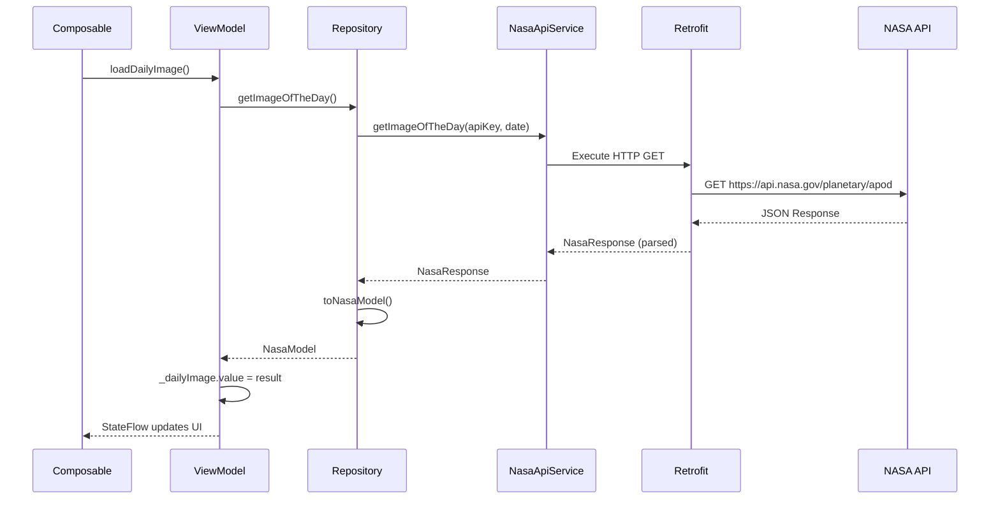

## Overview

NASA Explorer uses **Retrofit** to communicate with the NASA APOD (Astronomy Picture of the Day) API. Retrofit is a type-safe HTTP client that makes it easy to consume RESTful web services by converting API interfaces into callable Kotlin functions.

<Info>
Retrofit turns your HTTP API into a Java/Kotlin interface, providing compile-time validation of API requests and automatic serialization/deserialization.
</Info>

## Why Retrofit?

<CardGroup cols={2}>
  <Card title="Type Safety" icon="shield-check">
    Compile-time verification of API calls and responses
  </Card>
  <Card title="Easy Integration" icon="plug">
    Works seamlessly with Kotlin coroutines and suspend functions
  </Card>
  <Card title="Automatic Parsing" icon="gears">
    Converts JSON responses to Kotlin data classes automatically
  </Card>
  <Card title="Flexible" icon="wrench">
    Supports multiple converters and interceptors for customization
  </Card>
</CardGroup>

## Project Setup

Retrofit and its dependencies are configured in the build file:

```kotlin build.gradle.kts
dependencies {
    // Retrofit for network calls
    implementation(libs.retrofit2.retrofit)
    implementation(libs.converter.gson)  // JSON converter using Gson
    
    // Coil for image loading (works with Retrofit URLs)
    implementation(libs.coil.compose)
}
```

## NASA API Configuration

The API key is securely loaded from `local.properties`:

```kotlin build.gradle.kts
// Read local.properties
val localProperties = Properties().apply {
    load(project.rootProject.file("local.properties").inputStream())
}

// Get API key from local.properties
val nasaApiKey: String = localProperties.getProperty("nasaApiKey") ?: ""

android {
    defaultConfig {
        // Define buildConfigField with the API key
        buildConfigField("String", "NASA_API_KEY", "\"$nasaApiKey\"")
    }
    
    // Enable buildConfig
    buildFeatures {
        buildConfig = true
    }
}
```

<Warning>
Never commit your API key to version control. Add `local.properties` to `.gitignore`.
</Warning>

## Hilt Module Configuration

Retrofit is provided as a singleton through Hilt dependency injection:

```kotlin ApiNetworkModule.kt
package com.ccandeladev.nasaexplorer.data.di

import com.ccandeladev.nasaexplorer.data.api.NasaApiService
import dagger.Module
import dagger.Provides
import dagger.hilt.InstallIn
import dagger.hilt.components.SingletonComponent
import okhttp3.OkHttpClient
import retrofit2.Retrofit
import retrofit2.converter.gson.GsonConverterFactory
import javax.inject.Singleton

@Module
@InstallIn(SingletonComponent::class)
object ApiNetworkModule {

    private const val BASE_URL = "https://api.nasa.gov/"

    @Singleton
    @Provides
    fun provideNasaApiService(retrofit: Retrofit): NasaApiService {
        return retrofit.create(NasaApiService::class.java)
    }

    @Singleton
    @Provides
    fun provideRetrofit(okHttpClient: OkHttpClient): Retrofit {
        return Retrofit.Builder()
            .client(okHttpClient)              // Associate HTTP client
            .baseUrl(BASE_URL)                 // Base URL for API
            .addConverterFactory(GsonConverterFactory.create())  // JSON converter
            .build()
    }

    @Singleton
    @Provides
    fun provideHttpClient(): OkHttpClient {
        return OkHttpClient.Builder().build()
    }
}
```

<Tip>
Retrofit instances are expensive to create. By using `@Singleton`, the app creates only one instance that's shared throughout the application.
</Tip>

## API Service Interface

Define API endpoints as Kotlin interface methods with Retrofit annotations:

```kotlin NasaApiService.kt
package com.ccandeladev.nasaexplorer.data.api

import retrofit2.http.GET
import retrofit2.http.Query

interface NasaApiService {

    // Get image of the day (optionally for a specific date)
    @GET("planetary/apod")
    suspend fun getImageOfTheDay(
        @Query("api_key") apiKey: String,
        @Query("date") date: String? = null
    ): NasaResponse

    // Get images in a date range
    @GET("planetary/apod")
    suspend fun getImagesInRange(
        @Query("api_key") apiKey: String,
        @Query("start_date") startDate: String,
        @Query("end_date") endDate: String? = null
    ): List<NasaResponse>

    // Get random images
    @GET("planetary/apod")
    suspend fun getRandomImages(
        @Query("api_key") apiKey: String,
        @Query("count") count: Int,
    ): List<NasaResponse>
}
```

<Note>
The `suspend` keyword makes these functions work with Kotlin coroutines, allowing async network calls without blocking threads.
</Note>

## Response Data Class

API responses are automatically parsed into Kotlin data classes:

```kotlin NasaResponse.kt
package com.ccandeladev.nasaexplorer.data.api

import com.ccandeladev.nasaexplorer.domain.NasaModel

data class NasaResponse(
    val copyright: String?,
    val date: String,
    val explanation: String,
    val hdurl: String?,
    val media_type: String,
    val service_version: String,
    val title: String,
    val url: String
) {
    // Convert API response to domain model
    fun toNasaModel(): NasaModel {
        return NasaModel(
            title = title,
            url = url,
            explanation = explanation
        )
    }
}
```

### Example API Response

```json
{
  "copyright": "John Doe",
  "date": "2024-03-06",
  "explanation": "This stunning image shows...",
  "hdurl": "https://apod.nasa.gov/apod/image/2403/example_hd.jpg",
  "media_type": "image",
  "service_version": "v1",
  "title": "A Beautiful Galaxy",
  "url": "https://apod.nasa.gov/apod/image/2403/example.jpg"
}
```

## Repository Pattern

The repository encapsulates API calls and handles data transformation:

```kotlin NasaRepository.kt
package com.ccandeladev.nasaexplorer.data.api

import com.ccandeladev.nasaexplorer.BuildConfig
import com.ccandeladev.nasaexplorer.domain.NasaModel
import javax.inject.Inject

class NasaRepository @Inject constructor(
    private val nasaApiService: NasaApiService
) {
    companion object {
        private const val API_KEY = BuildConfig.NASA_API_KEY
    }

    // Get image of the day, optionally for a specific date
    suspend fun getImageOfTheDay(date: String? = null): NasaModel {
        val response = nasaApiService.getImageOfTheDay(apiKey = API_KEY, date = date)
        return response.toNasaModel()  // Convert to domain model
    }

    // Get images in a date range
    suspend fun getImagesInRange(startDate: String, endDate: String? = null): List<NasaModel> {
        val response = nasaApiService.getImagesInRange(
            apiKey = API_KEY,
            startDate = startDate,
            endDate = endDate
        )
        return response.map { it.toNasaModel() }
    }

    // Get a specific number of random images
    suspend fun getRandomImages(count: Int): List<NasaModel> {
        val response = nasaApiService.getRandomImages(apiKey = API_KEY, count = count)
        return response.map { it.toNasaModel() }
    }
}
```

## Usage in ViewModel

ViewModels call repository functions within coroutines:

```kotlin DailyImageViewModel.kt
@HiltViewModel
class DailyImageViewModel @Inject constructor(
    private val nasaRepository: NasaRepository,
    private val firebaseAuth: FirebaseAuth,
    private val firebaseDatabase: FirebaseDatabase
) : ViewModel() {

    private val _dailyImage = MutableStateFlow<NasaModel?>(null)
    val dailyImage: StateFlow<NasaModel?> = _dailyImage

    private val _errorMessage = MutableStateFlow<String?>(null)
    val errorMessage: StateFlow<String?> = _errorMessage

    private val _isLoading = MutableStateFlow(false)
    val isLoading: StateFlow<Boolean> = _isLoading

    fun loadDailyImage(date: String? = null) {
        viewModelScope.launch {
            _isLoading.value = true
            try {
                // Call repository which uses Retrofit
                val result = nasaRepository.getImageOfTheDay(date = date)
                _dailyImage.value = result
                _errorMessage.value = null
            } catch (e: Exception) {
                _errorMessage.value = "Sin conexión a internet. Conéctate a una red Wi-Fi"
                _dailyImage.value = null
            } finally {
                _isLoading.value = false
            }
        }
    }
}
```

## Request Flow

Here's how a typical API request flows through the app:



## Error Handling

Retrofit calls are wrapped in try-catch blocks to handle network errors:

```kotlin
fun loadDailyImage(date: String? = null) {
    viewModelScope.launch {
        _isLoading.value = true
        try {
            val result = nasaRepository.getImageOfTheDay(date = date)
            _dailyImage.value = result
            _errorMessage.value = null
        } catch (e: Exception) {
            // Handle network errors, timeouts, parsing errors, etc.
            _errorMessage.value = "Sin conexión a internet. Conéctate a una red Wi-Fi"
            _dailyImage.value = null
        } finally {
            _isLoading.value = false
        }
    }
}
```

## Query Parameters

Retrofit makes it easy to build URLs with query parameters:

```kotlin
// Calling this:
getImageOfTheDay(apiKey = "YOUR_KEY", date = "2024-03-06")

// Generates this URL:
https://api.nasa.gov/planetary/apod?api_key=YOUR_KEY&date=2024-03-06

// With optional parameters:
getImagesInRange(
    apiKey = "YOUR_KEY",
    startDate = "2024-03-01",
    endDate = "2024-03-05"
)

// Generates:
https://api.nasa.gov/planetary/apod?api_key=YOUR_KEY&start_date=2024-03-01&end_date=2024-03-05
```

## Benefits in NASA Explorer

<AccordionGroup>
  <Accordion title="Type-Safe API Calls">
    Retrofit validates API calls at compile time, catching errors before runtime. The Kotlin type system ensures correct parameters and return types.
  </Accordion>
  
  <Accordion title="Coroutine Integration">
    Suspend functions integrate seamlessly with Kotlin coroutines, enabling clean async code without callbacks.
  </Accordion>
  
  <Accordion title="Automatic Serialization">
    Gson converter automatically transforms JSON responses into Kotlin data classes, eliminating manual parsing.
  </Accordion>
  
  <Accordion title="Centralized Configuration">
    Base URL, converters, and interceptors are configured once in the Hilt module, making it easy to modify.
  </Accordion>
</AccordionGroup>

## Best Practices

<Steps>
  <Step title="Use Suspend Functions">
    Define API methods as suspend functions for seamless coroutine integration.
  </Step>
  
  <Step title="Repository Pattern">
    Wrap Retrofit calls in a repository layer to separate API logic from ViewModels.
  </Step>
  
  <Step title="Secure API Keys">
    Store API keys in `local.properties` and use BuildConfig to access them securely.
  </Step>
  
  <Step title="Handle Errors Gracefully">
    Wrap API calls in try-catch blocks and provide meaningful error messages to users.
  </Step>
  
  <Step title="Use Singleton Scope">
    Configure Retrofit as a singleton to avoid creating multiple instances.
  </Step>
</Steps>

## Advanced Features

<CardGroup cols={2}>
  <Card title="Interceptors" icon="filter">
    Add logging, authentication headers, or modify requests/responses
  </Card>
  <Card title="Custom Converters" icon="arrows-rotate">
    Support different serialization formats (Moshi, kotlinx.serialization)
  </Card>
  <Card title="Call Adapters" icon="plug">
    Integrate with RxJava, Flow, or other reactive frameworks
  </Card>
  <Card title="Request/Response Types" icon="file-code">
    Handle different body types (JSON, XML, Form data)
  </Card>
</CardGroup>

## Troubleshooting

<Warning>
**Common Issues:**
- Missing Gson converter causes serialization errors
- Incorrect BASE_URL (must end with `/`)
- API key not configured in `local.properties`
- Network calls on main thread (use suspend functions)
- Missing internet permission in AndroidManifest.xml
</Warning>

## Resources

<CardGroup cols={2}>
  <Card title="Retrofit Documentation" icon="book" href="https://square.github.io/retrofit/">
    Official Retrofit documentation
  </Card>
  <Card title="NASA APOD API" icon="rocket" href="https://api.nasa.gov/">
    NASA API documentation and registration
  </Card>
  <Card title="OkHttp" icon="globe" href="https://square.github.io/okhttp/">
    Underlying HTTP client used by Retrofit
  </Card>
  <Card title="Gson" icon="braces" href="https://github.com/google/gson">
    JSON serialization library used by Retrofit
  </Card>
</CardGroup>